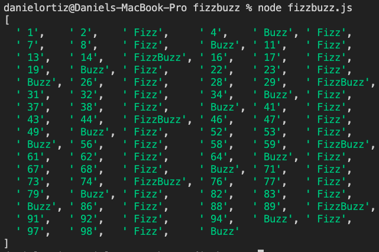
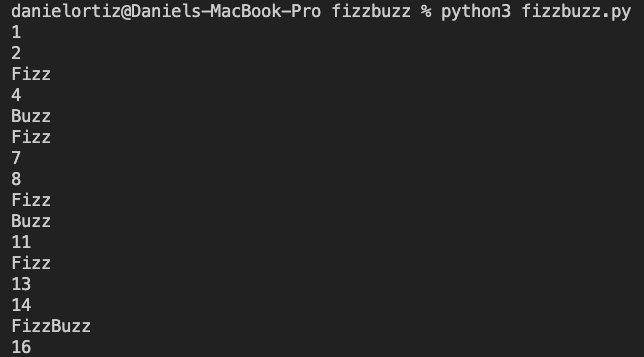
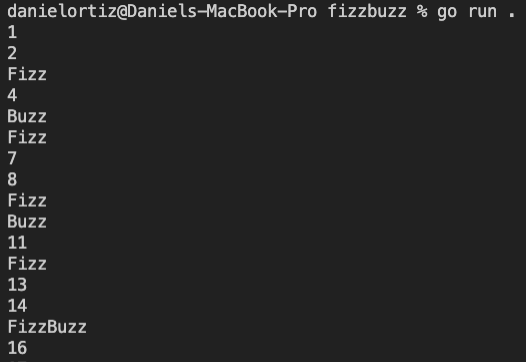

# Practicing Programming Language Agnostics
Practicing Programming Language Agnostics with the FizzBuzz Challenge

## Description:

I was challenged by Matt Sevey, founder and coach of, My Code Career, to complete the famous FizzBuzz Challenge. Except to not only complete it in a coding language that I am comfortable with like, JavaScript but to complete The FizzBuzz Challenge in two other coding languages which I have never touched before. I chose to work with Python and Go. The goal of this challenge was to be able to take the knowledge gained from what I have learned from JavaScript and The FizzBuzz Challenge and be able to apply the same principles within the other two coding languages by just revising the syntax.

I am very pleased to announce that I have completed this challenge with the help of google 😅. I was met with some adversity but was able to take the principles I knew from JavaScript and find how to rewrite the code to work with the other two coding languages. While this was not ideal due to no prior knowledge of how to use or work with Python and Go, it was rewarding to see that it is possible, and I should not shy away from a language because I have yet to learn it. Great lessons learned and I look forward to the next project!

